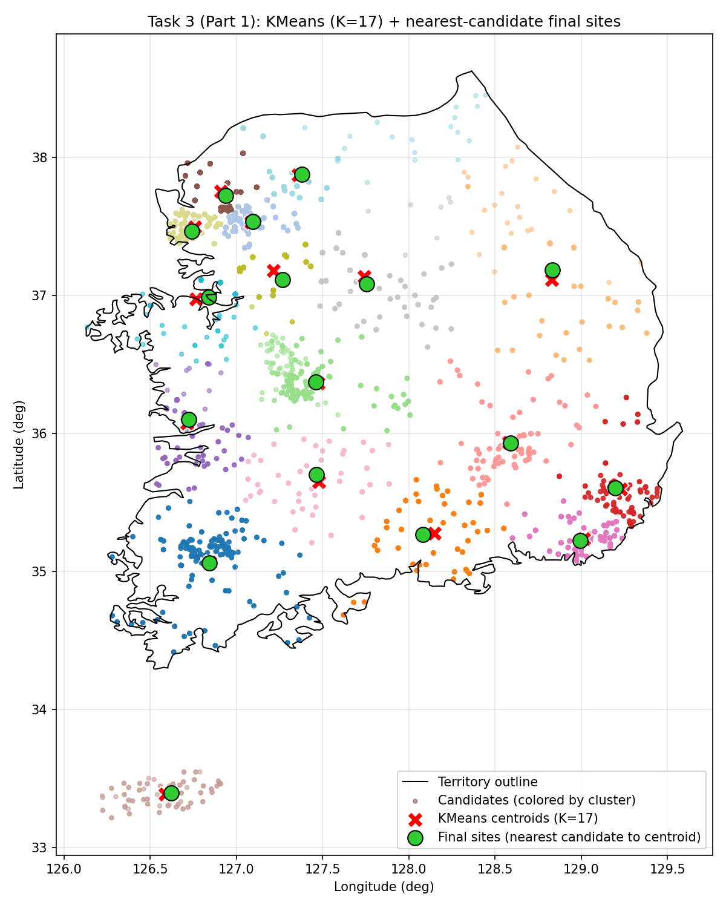
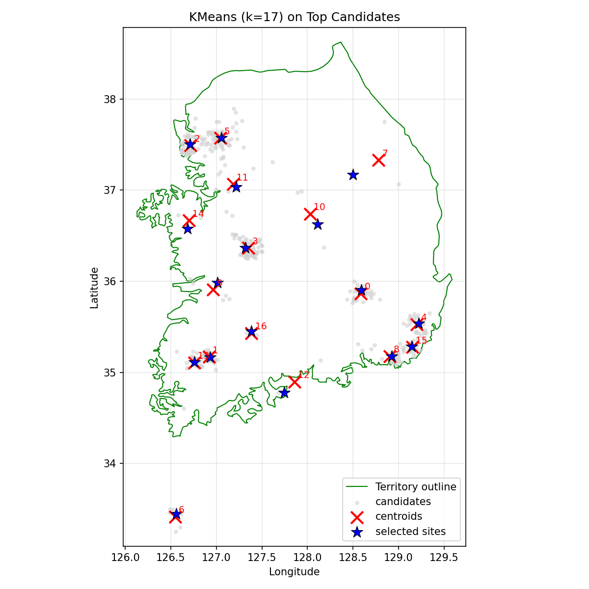

# Task 3: Vertiport Candidate Scoring and Selection

This task ranks candidate vertiport locations, then compares final site selection using:

- all candidates, and
- only the top-ranked candidates.

## Problem and Strategy

The candidate list is too large to choose final vertiport locations directly. Some candidates are also better than others because they are closer to traffic, hospitals, and tourist areas. The strategy is therefore:

1. Score all candidates using additional datasets.
2. Keep only the best-ranked candidates.
3. Compare K-means on the full set versus K-means on the top-ranked set.
4. Snap the centroids to the nearest real candidate so the final sites are valid locations.

This gives two comparable solutions:

- a raw all-candidate solution,
- and a refined top-candidate solution.

## Task 3.1 Scripts

### 1. Build candidate scores

Script:

- `task3/task3.1/build_candidate_scores.py`

Inputs:

- `data/Data_vertiport_candidates.csv`
- `data/Traffic_Data.csv`
- `data/General_Hospitals_Coordinates.csv`
- `data/Tourist_Attraction_Data.csv`

Output:

- `task3/task3.1/produced_data/Processed_Data_vertiport_candidates_scores.csv`
- `task3/task3.1/produced_data/Top_400_Candidates.csv`

Run:

```powershell
py -3 task3\task3.1\build_candidate_scores.py --candidates-csv data\Data_vertiport_candidates.csv --hospitals-csv data\General_Hospitals_Coordinates.csv --tour-csv data\Tourist_Attraction_Data.csv --traffic-csv data\Traffic_Data.csv --output-processed task3\task3.1\produced_data\Processed_Data_vertiport_candidates_scores.csv --top-n 400 --output-top task3\task3.1\produced_data\Top_400_Candidates.csv
```

### 2. Cluster all candidates

Script:

- `task3/task3.1/kmeans_17_vertiports.py`

Purpose:

- Run K-means on the full candidate list
- Choose the nearest real candidate to each centroid
- Save comparison-ready outputs

## All-candidate result

The plot below shows the final all-candidate clustering result.


Run:

```powershell
py -3 task3\task3.1\kmeans_17_vertiports.py data\Data_vertiport_candidates.csv data\Data_South_Korea_territory.csv --k 17 --random-state 42
```

### 3. Cluster only top candidates

Script:

- `task3/task3.1/kmeans_on_top_candidates.py`

Purpose:

- Run K-means on `Top_400_Candidates.csv`
- Snap each centroid to the nearest top candidate using Haversine distance
- Plot the territory outline and the selected sites

## Top-candidate result

The plot below shows the final top-candidate clustering result.


Run:

```powershell
py -3 task3\task3.1\kmeans_on_top_candidates.py --candidates task3\task3.1\produced_data\Top_400_Candidates.csv --k 17 --random-state 42
```

## Output folder

Comparison-ready files are saved in:

- `task3/task3.1/produced_data/`

This folder contains the all-candidate outputs, the top-candidate outputs, and the score tables.

## Results and comparison

Below we present the saved plots and a concise comparison between the two approaches (K-means on the full candidate set vs K-means on the Top-ranked candidates).

### Plots

- All-candidate final selection (saved):

	

- Top-candidate final selection (saved):

	

### Quantitative comparison (k = 17)

- Final sites selected by each method: **17** (each)
- Matched sites (within 0.5 km): **0** — the two methods returned disjoint selections for this run.

Observed differences
- The all-candidate solution reflects purely spatial cluster centroids across the raw candidate set.
- The top-candidate solution prefers locations with higher combined Traffic / Hospital / Tourist scores before clustering.
- Several coastal and regional choices (including some Jeju-area candidates) differ because the scoring pipeline upweights accessibility and amenity proximity.

Recommendation
- For a defensible vertiport site selection that accounts for operational demand and supporting infrastructure, we recommend the **top-candidate** pipeline: `task3/task3.1/build_candidate_scores.py` -> `kmeans_on_top_candidates.py`.


## Comparison idea

- The full-candidate approach shows how K-means behaves on the raw candidate set.
- The top-candidate approach is usually preferred because it uses traffic, hospital, and tourist data before clustering.
- Jeju candidates may appear outside the plotted polygon because the provided territory file is not a perfect Jeju boundary.

## Why the top-candidate method is useful

The top-candidate pipeline is the stronger final method for this project because it does not rely on geometry alone. It first evaluates each location using supporting data and then clusters only the best sites. This makes the final vertiport selection easier to justify in the report.

## Notes

- The scoring pipeline deduplicates candidate coordinates by default.
- K-means uses a fixed `random_state` for reproducibility.
- The plotting scripts open the figure window and also save PNG files to `produced_data`.
